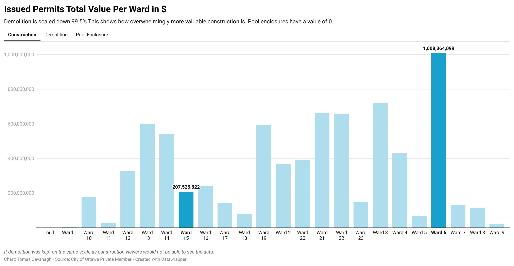

**November 29,2021**<br>
**MPAD2003 Introductory Data Storytelling**<br>
**Tomas Cavanagh**<br>
**Presented to Jean-Sébastien Marier**<br>

# Project 2: Basic Data Analysis & Visualization

## 1. Introduction

The goal of this project is to demonstrate our knowledge of the key concepts taught in this course. This involves importing a dataset, organizing/cleaning a dataset, analyzing it, and then shifting it into a visual format. The main sections of this assignment follow this exact pattern, while documenting our process as we move through the various stages necessary to manipulate the data in order to deliver a story in a visual format.
 
The dataset being used for this project consists of the number of permits issued monthly for construction, demolition, and pool enclosure projects by the city of Ottawa. The source of this information is the city of Ottawa’s open data portal, an extremely useful tool that this course has utilized throughout the semester. The creator of the dataset collected information such as the addresses, wards, building type, contractor, postal code etc. 

### [The dataset used](https://docs.google.com/spreadsheets/d/1buEjY8FHbiGG7ASw9OTzUaKIsNsW6RLX--uKS8zwzNo/edit?usp=sharing)
<br>

## 2. Getting Data

As it was mentioned in the instructions, the CSV file was too large to use the IMPORTDATA function. This is why I decided to use the provided google sheets document, and simply made a copy of it so that I was able to edit properly. However, I could have also saved the CSV file to my computer and then imported it into a new google sheets document as well. 

<br>
This dataset was made by a private creator, and they published it on February 11, 2020. The most recent update to this database was completed on February 13, 2021, nearly exactly one year after it was published. This is a very large dataset! It consists of sixteen columns and twelve-thousand five-hundred and forty nine rows.  

There are a variety of variable types present in this dataset. However, there are certain types that appear much more often than others. For example, columns like application type, description, municipality, contractor etc. all fall under the nominal variables categorie. These columns are not measured as numbers, but you can easily calculate how many times the specific values appear in the dataset. The argument could be made that there are either one or no ordinal variables whatsoever. The only column to potentially meet the criteria for this is column L. This column indicates the value of each permit (the higher the value the higher it is on the ranking scale), but there is no clear set range for the ranking scale. The dataset also includes many discrete variables, such as column A, which lists the street numbers the permits have been issued to. 

**The main things that caught my attention at first glance are:**
- The sheer magnitude of the dataset (it is huge!)
- The number of columns I will be able to delete
- The decent formatting, it can easily be re-organized into a cleaner format
- There are some empty cells, most of which come from the LOT column

## 3. Understanding Data
 I began the cleaning process by deleting all columns I felt were irrelevant to the information I was searching for. While they could be useful in other projects, they served no purpose for mine. Columns A,B,C, and N were some that fell under this category. I continued on by freezing the first row (headers), and then applied a filter to it as well. This was accomplished by using the 'tools' and 'data' add ons at the top of google sheets. The last step in the general cleanup was to remove all of the extra whitespace in the dataset, I simply selected the whole table and pressed 'remove whitespace'. At this point I had a much more manageable dataset, but there was still much more work to be done. <br>
My next step was to fix up the 'Values' column. I did this by using the find and replace tool. I replaced all spaces with commas. After this, google sheets was now able to recognize the values as a currency so I adjusted the format from general numbers to a specific currency. <br>
The final major adjustments that I made were to the 'issued date' column. Firstly, I used the GOOGLETRANSLATE function to convert all of the dates to english (as they seemed to switch between the two languages). However, I ran into a bit of an issue. The abbreviation for september: "sept", translated to "seven". To fix this, I copied the column and then pasted it as values only. Thanks to this I was able to utilize the find and replace tool yet again, replacing all "sevens'' with "september". Afterwards, I made a couple other minor adjustments to the month's acronyms and the dates were finally in a consistent format.<br>
I did not use either of the SPLIT or CONCATENATE functions to reformat the data. 

<br>

```r
FUNCTIONS USED:
=SUM() 
The number of dwelling units in the dataset RESULT: 35,395 
=MODE() 
CONSTRUCTION RESULT: N/A  DEMOLITION RESULT: 58,000  POOL RESULT: N/A
=MEDIAN() 
CONSTRUCTION RESULT: 225,661,402 DEMOLITION RESULT: 265,843 POOL RESULT: 0.00 
=AVERAGE() 
CONSTRUCTION RESULT: 319,471,044.29 DEMOLITION RESULT: 496,268.62 POOL RESULT: 0.00 
=GOOGLETRANSLATE() 
RESULT: Shifted dates written in french to english
```
<br>


After cleaning and analyzing the data, there is one glaringly obvious statistic that is practically impossible to ignore. The difference in value between the three application types is astounding. On two opposite ends of the spectrum there is pool enclosures and construction. Pool enclosures contain a total value of zero, and construction holds a total value upwards of 7.5 billion dollars! <br>
The underlying story that my analysis made very apparent is how the wards compare to each other. Ward 6 is the clear front runner in terms of number of high valued permits issued. It has a total value of just over 1 billion dollars. In contrast, ward 1 has not made many changes. This is made clear as it only has 5 million dollars in total value, only  0.5% of ward 6's total value! <br>
These same numbers are what I am going to show with my visualization. Obviously they sound quite staggering as you read, but when they are converted into a visual format it represents the data in an even better fashion. The values per application type for each ward are what will be presented in the visualization.

### [Public link for final spreadsheet](https://docs.google.com/spreadsheets/d/1buEjY8FHbiGG7ASw9OTzUaKIsNsW6RLX--uKS8zwzNo/edit?usp=sharing)

## 4. Delivering Data
To prepare the data for visualization I had to reverse one of my big steps in the cleaning data process. I had to change the values column in my pivot table back to regular numbers, rather than a currency. I used the pivot table rather than uploading the entire spreadsheet to datawrapper. This simplified the process, as all of the information needed for my chart was already in the pivot table. 
Once my data had been uploaded, it was a matter of specifying titles, values, design choices, scale etc. to bring my visualization to life.
 <br><br>
*The graph created with Datawrapper*

### [Public Link for Interactive Chart](https://datawrapper.dwcdn.net/CjNaw/1/)

 I chose a column chart because it was the clear choice as to what would best represent the story I am telling. This chart (along with some design specifications) do a nice job at illustrating the contrast between both the individual ward values, and between the application types as a whole. The highlighted bars show the most valuable ward for construction (6) and for demolition (15). Having both the scale on the left hand side and the numbers above each column when you hover over ensures that nothing is left to the imagination for viewers. I chose to include the pool enclosures even though it presents no data because it completes the trifecta of application types.

## 5. Conclusion

In conclusion, construction is by far the most valuable out of the three application types. This was demonstrated through the spreadsheet and then made glaringly obvious because of the visualzation. 

## 6. References

Include a list of your references here.
