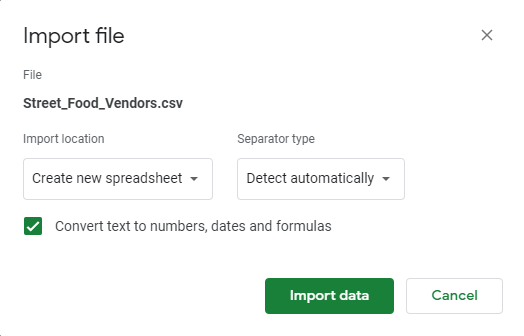

**November 29,2021**<br>
**MPAD2003 Introductory Data Storytelling**<br>
**Tomas Cavanagh**<br>
**Presented to Jean-Sébastien Marier**<br>

# Project 2: Basic Data Analysis & Visualization

Use one hashtag symbol (`#`) to create a level 1 heading like this one.

## Foreword

I have been assigning different versions of this project to my digital journalism and data storytelling students for a few years now. Its structure was inspired by the main sections/chapters of [*The Data Journalism Handbook*](https://datajournalism.com/read/handbook/one/). This version was further inspired by the [Key Capabilities in Data Science](https://extendedlearning.ubc.ca/programs/key-capabilities-data-science) program offered by the University of British Columbia (UBC).

**Here are some useful resources for this assignment:**

* [GitHub's *Basic writing and formatting syntax* page](https://docs.github.com/en/github/writing-on-github/getting-started-with-writing-and-formatting-on-github/basic-writing-and-formatting-syntax)
* [GitHub Guides: Mastering Markdown](https://guides.github.com/features/mastering-markdown/)
* [The template repository for this assignment in case you delete something by mistake](https://github.com/jsmarier/Template-for-the-Basic-Data-Analysis-Visualization-Project)

Did you notice how to create a hyperlink? In Markdown, we put the clickable text between square brackets and the actual URL between parentheses.

And to create an unordered list, we simply put a star (`*`) before each item.

## 1. Introduction

The goal of this project is to demonstrate our knowledge of the key concepts taught in this course. This involves importing a dataset, organizing/cleaning a dataset, analyzing it, and then shifting it into a visual format. The main sections of this assignment follow this exact pattern, while documenting our process as we move through the various stages necessary to manipulate the data in order to deliver a story in a visual format.
 
The dataset being used for this project consists of the number of permits issued monthly for construction, demolition, and pool enclosure projects by the city of Ottawa. The source of this information is the city of Ottawa’s open data portal, an extremely useful tool that this course has utilized throughout the semester. The creator of the dataset collected information such as the addresses, wards, building type, contractor, postal code etc. 

### [The dataset used](https://docs.google.com/spreadsheets/d/1buEjY8FHbiGG7ASw9OTzUaKIsNsW6RLX--uKS8zwzNo/edit?usp=sharing)
<br>

## 2. Getting Data

As it was mentioned in the instructions, the CSV file was too large to use the IMPORTDATA function. This is why I decided to use the provided google sheets document, and simply made a copy of it so that I was able to edit properly. However, I could have also saved the CSV file to my computer and then imported it into a new google sheets document as well. 

<br>
This dataset was made by a private creator, and they published it on February 11, 2020. The most recent update to this database was completed on February 13, 2021, nearly exactly one year after it was published. This is a very large dataset! It consists of sixteen columns and twelve-thousand five-hundred and forty nine rows.  

There are a variety of variable types present in this dataset. However, there are certain types that appear much more often than others. For example, columns like application type, description, municipality, contractor etc. all fall under the nominal variables categorie. These columns are not measured as numbers, but you can easily calculate how many times the specific values appear in the dataset. The argument could be made that there are either one or no ordinal variables whatsoever. The only column to potentially meet the criteria for this is column L. This column indicates the value of each permit (the higher the value the higher it is on the ranking scale), but there is no clear set range for the ranking scale. The dataset also includes many discrete variables, such as column A, which lists the street numbers the permits have been issued to. 

**The main things that caught my attention at first glance are:**
- The sheer magnitude of the dataset (it is huge!)
- The number of columns I will be able to delete
- The decent formatting, it can easily be re-organized into a cleaner format
- There are some empty cells, most of which come from the LOT column


### 2.1. Importation

Use three hashtag symbols (`###`) to create a level 3 heading like this one. Please follow this template when it comes to level 1 and level 2 headings. However, you can use level 3 headings as you see fit.

To include a screen capture, use the sample code below. Your images should be saved in the same folder as your `.md` file.

<br>
*Figure 1: The "Import file" prompt on Google Sheets.*

**Here are examples of functions and lines of code put in grey boxes:**

1. If you name a function, put it between "angled" quotation marks like this: `IMPORTHTML`.
1. If you want to include the entire line of code, do the same thing, albeit with your entire code: `=IMPORTHTML("https://en.wikipedia.org/wiki/China"; "table", 5)`.
1. Alternatively, you can put your code in an independent box using the template below:

``` r
=IMPORTHTML("https://en.wikipedia.org/wiki/China"; "table", 5)
```
This also shows how to create an ordered list. Simply put `1.` before each item.

## 3. Understanding Data

I accomplished all of my data cleaning thanks to the various tools available through google sheets. That veing said, I did not use OpenRefine.
I began the cleaning process by deleting all columns I felt were irrelevant to the information I was searching for. While they could be useful in other projects, they served no purpose for mine. Columns A,B,C, and N were some that fell under this category. I continued on by freezing the first row (headers), and then applied a filter to it as well. This was accomplished by using the 'tools' and 'data' add ons at the top of google sheets. At this point I had a much more manageable dataset, but there was still much more work to be done. 
<br>

<br>


## 4. Delivering Data

Insert text here.

**This section should include a screen capture of your chart and its public link, like so:**

<br>
*Figure 2: The map created with Datawrapper*
[Interactive version here](https://datawrapper.dwcdn.net/o7Wwp/2/)

## 5. Conclusion

Thank you for reading my report.

## 6. References

Include a list of your references here.
